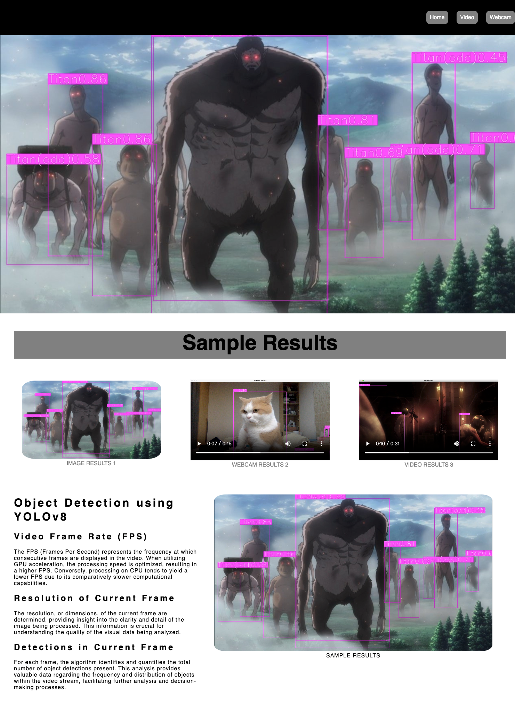
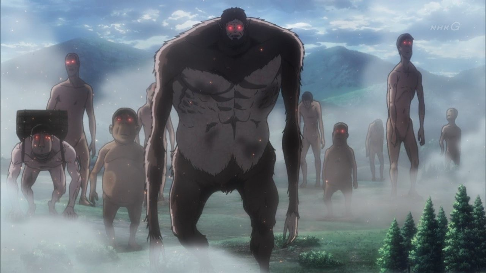
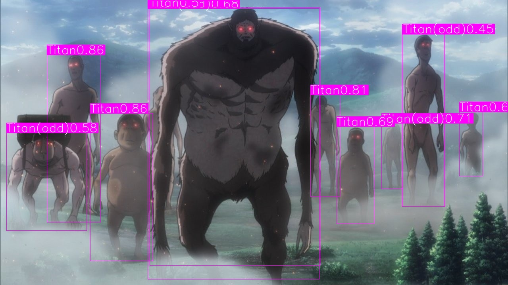

# Web Application using YOLOv8 

*Discription:*

***1.In this project,we used the Flask framework to create a user-friendly web application. The application's primary function is to perform recognition tasks using YOLOv8, an advanced object detection model. Users can upload images and videos for analysis and use their device's camera for real-time object detection.***

**1.Requirements and dependencies**
  * Python 3.8 (https://www.python.org/downloads/)
  * Opencv-contrib-python (3.4.2.17)
  * Matplotlib 3.7.3
  * UI framework: pyqt5 (5.15.10)
  * Pytorch 2.1.0
  * Torchvision 0.16.0
  * Torchsummary 1.5.1
  * Tensorboard  2.14.0
  * Pillow 10.1.0
  * ultralytics==8.0.26
  * opencv-python-headless==4.1.2.30

**2.Usage:**

1. Downloads whole repository.
2. Change the path into Web.
3. Run the `flaskapp.py`.
4. copy the URL `http://127.0.0.1:5000` paste on your browser.
5. Follow the Website userface.

## 1.Detect the image

## 2.Detect the video

https://github.com/Kung-hen/Real-Time-Object-Detection-Web-Application-using-YOLOv8/assets/95673520/f269b3ee-0ab6-43ce-aadb-28767c01228c

https://github.com/Kung-hen/Real-Time-Object-Detection-Web-Application-using-YOLOv8/assets/95673520/29d3d3c3-f7e9-407e-8037-05cf0c949365

## 3.Real-time classification in webcam

https://github.com/Kung-hen/Real-Time-Object-Detection-Web-Application-using-YOLOv8/assets/95673520/0017b982-b243-4c60-9c9e-c4f38fbe8dfd

